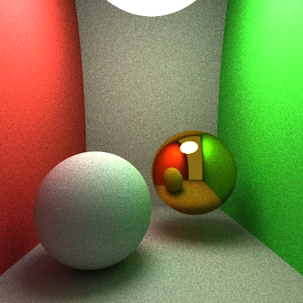
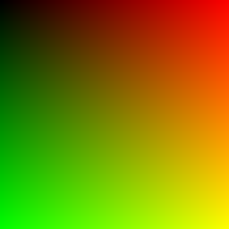
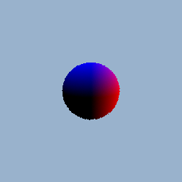
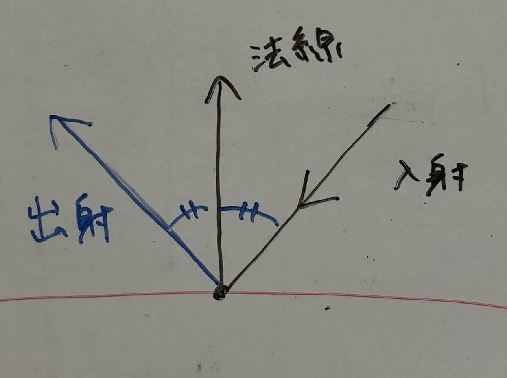

# Ray Tracing on Processing

穴埋め形式で簡単なパストレーサーを書き、光の反射を再現します。最後までやると以下のような画像が得られます。




## 目次
* [パストレーシングとは](#パストレーシングとは)
* [サンプルプログラムの解説](#サンプルプログラムの解説)
* [一つの球体を表示する](#一つの球体を表示する)
	* [レイトレーシング機能の追加](#レイトレーシング機能の追加)
	* [レイトレーシングの基本](#レイトレーシングの基本)
	* [Ex. A](#Ex.-A)
* [たくさんの物体を表示する](#たくさんの物体を表示する)
	* [レイトレーシングの書き換え](#レイトレーシングの書き換え)
	* [Ex. B](#Ex.-B)
* [パストレーシングで陰影をつける](#パストレーシングで陰影をつける)
	* [追跡処理の流れ](#追跡処理の流れ)
	* [サンプルの平均](#サンプルの平均)
	* [Ex. C](#Ex.-C)
* [仕様](#仕様)


## パストレーシングとは


本編のほうはあまり深入りしないで説明してるので、細かい仕様について疑問がある人はslack上で質問するか一番下の[仕様](#仕様)の項目を参照してください。

---

## サンプルプログラムの解説

レイトレーシングによるレンダリングでは、各ピクセルに対してどのような色を表示するかを計算し、結果画像を得ます。
サンプルファイルをダウンロードしてください。実行すると、次のような画像が表示されます。



#### `void setup()`

```processing
void setup() {
	colorMode(RGB, 1.0);
	size(512,512);
}
```

今回は光の強さを直接計算しやすいよう、`colorMode(RGB, 1.0)`を使います。

#### `void draw()`

```processing
void draw() {
	// pixels を更新
	loadPixels();
	for (int y=0; y<height; y++) {
		for (int x=0; x<width; x++) {
			pixels[y*width + x] = render(x, y);
		}
	}
	updatePixels();
}
```

ここでは結果画像の値を直接計算しています。for文を使ってすべての `(x, y)` のピクセルにアクセスし、 `render(x, y)` という関数で値を計算しています([復習 - 画素の操作による画像処理](http://www.design.kyushu-u.ac.jp/~morimoto/teaching/materials/ballGame8.html#1-%E7%94%BB%E7%B4%A0%E3%81%AE%E6%93%8D%E4%BD%9C%E3%81%AB%E3%82%88%E3%82%8B%E7%94%BB%E5%83%8F%E5%87%A6%E7%90%86))。
それでは `render(x, y)` の中身をみていきましょう。

#### `color render(int x, int y)`

```processing
color render(int x, int y) {
	PVector result = new PVector((float)x/width, (float)y/height, 0);
	return toColor(result);
}
```

この関数は、座標 `(x, y)` を受け取って色を返す関数です。あとでの計算のしやすさのために一旦`PVector` を使い、 `toColor` 関数で `color` 型に変換するという方法をとっています。

サンプルではRの値が`x/width`, Gの値が`y/height`, そしてBは0 になっています。つまり画像の右へいくほど赤、下へ行くほど緑になっていくというプログラムになっています。

このサンプルを書き換えていき、パストレーシングを行います。

---

## 一つの球体を表示する

まずは、各ピクセルにおいてレイトレーシングがどのように物体の色を表示しているかを一つの物体を表示するプログラムで説明します。以下の指示に従ってprt.pde のプログラムを書き換えてください。

### レイトレーシング機能の追加

#### 1. グローバル変数として以下を追加

```processing
Camera camera;
Material environment;
Sphere sphere;
```
`void setup()`や`void draw()`などのメソッドより外側に上のコードをコピペします。
ここに宣言した変数はグローバル変数(または大域変数)と呼ばれ、processing のすべての場所から使うことができます
( [スコープ](http://www.design.kyushu-u.ac.jp/~morimoto/teaching/materials/drawing0.html#2-%E3%82%B9%E3%82%B3%E3%83%BC%E3%83%97) )。

ここにカメラ、背景、物体(球)を保持し、処理のために使います。

#### 2. シーンを定義する関数を追加

```processing
void createScene() {
	// (0,-10,2)から(0,0,0)を見るカメラを設定. 焦点距離は55mm.
	camera = new Camera(new PVector(0,-10,2), new PVector(0,0,0), 55);
	
	// 背景色(発光)を設定する
	environment = new Material(new PVector(0.6, 0.7, 0.8), null);
	
	// 材質を用意する
	Material white	= new Material(null, new PVector(0.6, 0.6, 0.6), MtlType.DIFFUSE);
	Material red	= new Material(null, new PVector(0.8, 0.2, 0.2), MtlType.DIFFUSE);
	Material green	= new Material(null, new PVector(0.2, 0.8, 0.2), MtlType.DIFFUSE);
	
	// (0,0,0) に半径2の赤い球を配置
	sphere = new Sphere(new PVector(0, 0, 0), 2, red);
}
```
ここでシーンの各パラメータを決めます。
使われている関数のパラメータは、

`Camera( カメラ位置, どこを見るか, 35mm換算の焦点距離 )`<br>
`Material( 発光色, 反射色, 反射タイプ(省略可) )`<br>
`Sphere( 中心の位置, 半径, マテリアル )`

です。詳しくは[クラスの仕様](#クラス)をみてください。

そして`void setup()`内で`createScene()`を呼び出します。

```processing
void setup() {
	colorMode(RGB, 1.0);
	size(512,512);

	createScene();
}
```

#### 3. `color render(int x, int y)` を書き換え

```processing
color render(int x, int y) {
	Ray view = camera.ray(x, y, random(1), random(1)); // ★
	Hit hit = sphere.intersect(view, 0.0001, 10000); // ◆
	
	// レイと物体の交点があれば、物体の色を返す
	// なければ背景の色を返す
	if(hit != null) return toColor(hit.material.Color()); // ▼
	else return toColor(environment.emission);
}
```

ここで各ピクセル方向への**★視線の生成**, 球体との**◆交差判定**, 判定結果による**▼描画色の決定**を行っています。現時点でプログラムで実行すると、シーンで配置したように中央に赤い球体が出ます。


### レイトレーシングの基本
レイトレーシングでおこなう**視線の生成**, **交差判定**, 判定結果による**描画色の判断**それぞれの処理について説明します。

#### ★視線の生成

まず、ピクセルの位置が決まることで**どこ**から**どの方向**を視線が向いているかが決定します。今回のプログラムでは、`Camera.ray`という関数を使って視線を求めます。視点と視線の方向は`Ray`クラスに保持されます。

```processing
class Ray {
	PVector o; // レイの原点(視点)
	PVector d; // レイの方向
}
```

#### ◆交差判定

視線が決まったらそれが物体と交差するかを判定し、交点の情報を計算します。


このために`Hit Sphere.intersect(ray, tmin, tmax)`という関数を使います。
これは、球と視線が距離の区間 ( tmin, tmax ) の範囲で交差するかを判定します。
返り値として、交点があればその点の情報**`Hit`**を返し、無ければ**`null`**を返します。
カメラの前にある物体を判定したいので、区間にはとりあえず十分に広い正の範囲を設定します。

返り値である**`Hit`**クラスの内容はつぎのようになっており、色や照明の計算に利用されます。

```processing
class Hit {
	float distance;		// 視点から交点までの距離
	PVector position;	// 交点の位置
	PVector normal;		// 交点の法線
	Material material;	// 交点の材質
}
```

processing における**`null`** とは、変数の実態が確保されていないことを示します。
ここでは交差判定の結果レイと物体が交点をもたないことを表し、その視線方向が背景なのかを判定するために使われます。


#### ▼描画色の決定
得られた`Hit` 情報を使って最終的な色を決めます。ここでは物体の交点があれば物体色`hit.material.Color()`を返し、無ければ背景色`environment.emission`を返すという処理をしています。
交点がないとき`hit == null`なので、if文で判定しています。

```processing
if(hit != null) return toColor(hit.material.Color());
else return toColor(environment.emission);
```

### Ex. A
1. 球体やカメラのパラメータを変更した画像を作ってください。
2. 物体色を法線の値を使って決めてください。法線は`Hit`クラスの中に格納されています。


---


## たくさんの物体を表示する
レイとシーン中の物体が複数の交点を持つとき、前後関係を正しく描画するためには目から一番近い交点を採用する必要があります。図のような状況では、a~d のうち一番近い点のa で交差したと判断し、赤い色を返すようにします。


この処理をおこなう関数`Hit findNearestIntersection(Ray ray, float tmin, float tmax)`を追加し、`render`のほうで利用するようにします。以下のようにプログラムを書き換えてください。

### レイトレーシングの書き換え
#### シーンの変更
複数のオブジェクトを配置します。まずグローバル変数で宣言した球体を配列に変更します。

```processing
Sphere sphere;
	↓ 書き換え
Sphere[] spheres;
```

次に`createScene`を以下で置き換えてください。

```processing
void createScene() {
	// (0,-10,2)から(0,0,0)を見るカメラを設定. 焦点距離は55mm.
	camera = new Camera(new PVector(0,-10,2), new PVector(0,0,2), 55);
	
	// 背景色(発光)を設定する
	environment = new Material(new PVector(0.6, 0.7, 0.8), null);
	
	// 材質を用意する
	Material white	= new Material(null, new PVector(0.6, 0.6, 0.6), MtlType.DIFFUSE);
	Material red	= new Material(null, new PVector(0.8, 0.2, 0.2), MtlType.DIFFUSE);
	Material green	= new Material(null, new PVector(0.2, 0.8, 0.2), MtlType.DIFFUSE);
	Material mirror	= new Material(null, new PVector(0.9, 0.6, 0.1), MtlType.SPECULAR);
	Material light	= new Material(new PVector(10,10,10), null);
	
	// 球を配置する
	spheres = new Sphere[] {
	    new Sphere(new PVector(-2 ,-1.5, 0), 2,  white), // ball left
	    new Sphere(new PVector( 2 , 1.5, 1), 2, mirror), // ball right
	    new Sphere(new PVector( 0,-2,10), 3,  light),	 // light
	    new Sphere(new PVector( 105, 0, 0), 100, green), // wall left
	    new Sphere(new PVector(-105, 0, 0),	100,   red), // wall right
	    new Sphere(new PVector( 0, 0,-102),	100, white), // floor
	    new Sphere(new PVector( 0, 110, 0),	100, white), // wall back
	};
}
```

#### `color render(int x, int y)`の変更
`render`内の処理を`findNearestIntersection`を使うように書き換えます。

```processing
Hit hit = sphere.intersect(view, 0.0001, 10000);
	↓ 書き換え
Hit hit = findNearestIntersection(view, 0.0001, 10000);
```

#### `findNearestIntersection`の追加
最後に、`findNearestIntersection`を作ります。

```processing
Hit findNearestIntersection(Ray ray, float tmin, float tmax) {
	Hit hit = null;

	// ここに一番近い交点を探し、hit に代入する処理を書く
	////////////////////////////////////////////


	////////////////////////////////////////////

	// 最後に、球が裏面の場合は法線を反転する
	if (hit != null && PVector.dot(ray.d, hit.normal)>0) {
		hit.normal.mult(-1);
	}

	return hit;
}
```

いまこの中身は不完全なので、処理を考えてください。

### Ex. B
配列すべての球との交差判定をおこない、一番近い交点情報を返す関数を完成させてください。レイと交点との距離は`Hit.distance`に格納されています。

関数が完成し、`render`内で物体色や法線を描画をすると次のような画像が得られます。

| `hit.material.Color()` で描画 | `hit.normal` で描画 |
|:-:|:-:|
|  |  |

---

## パストレーシングで陰影をつける

現時点で配置した物体に設定した色を描画することができました。最後に物体面での反射を繰り返し追跡することにより照明を再現します。

### 追跡処理の流れ

照明のあたった物体の色は、入射光と物体色の積として求められます。物体色のほうは`material`に保持されていますが、入射光を得るためには再びレイトレーシングによる追跡をおこないます。
もし追跡結果の交点が光源であれば、その強さが入射光です。
交点が反射面である場合には、さらに追跡を続けます。


以上の機能を`PVector trace(Ray ray, int n)`という関数として追加します。
あまりに反射を繰り返し続けることを防ぐため反射回数`n`をカウントし、適当な回数で処理を打ち切ります。


```processing
PVector trace(Ray ray, int n) {

	// 反射回数が多いとき追跡をやめる(黒を返す)
	if (10<n) return new PVector(0, 0, 0);

	Hit hit = findNearestIntersection(ray, 0.0001, 100000); // 光線と物体の交点を探す
	PVector result = new PVector(0,0,0); // 結果用の変数

	// 交点がないとき背景からの放射を返す
	if (hit == null) return environment.emission;

	// 光源にあたったとき(emission があるとき) その値を結果に足す
	if (hit.material.emission != null) result.add(hit.material.emission);


	// 反射面に当たったとき(reflection があるとき)、さらに入射方向を追跡し、反射光を結果に足す
	if (hit.material.reflection != null) {

		// 接面の基(T, B, hit.normal)を用意する
		PVector T = new PVector();
		PVector B = new PVector();
		tangentspace_basis(hit.normal, T, B);

		// 反射の種類によって追跡する方向を決め、ray を更新する
		switch (hit.material.type) {
		case DIFFUSE:
			// 拡散反射する光線の原点と方向を更新する

			PVector dir = sampleHemisphere_cosine(random(1), random(1));
			ray.o = 
			ray.d = 
			break;

		case SPECULAR:
			// 鏡面反射する光線の原点と方向を更新する
			
			ray.o = 
			ray.d = 
			break;
		}

		result.add( /*　ray方向から入ってくる入射光と物体色の積を結果に足す　*/ );
	}

	return result;
}
```

これを`render` のほうで利用します。


### サンプルの平均

`trace`では本来あらゆる方向から入射してくる光のうち一方向だけを選んで追跡することで、目と光源を結ぶ一本の経路を作っています。この行為や、得られた経路のことをサンプル(標本抽出/標本)といいます。

ひとつのサンプルから正確な光の量を計算することは難しいですが、たくさんのサンプルを平均することでより広い入射をカバーし、より正解に近い結果を得ることができます。
この例として実行時1フレームごとに新たなサンプルを引き、他のサンプルとあわせた平均を描画するという処理を実装します。


* **グローバル変数に以下を追加**
```processing
int spp = 0; // サンプル数
PVector[] accumlated_radiance; // 寄与の合計を入れておく配列
```

* **`void draw()` の中でサンプル数をカウントする**
```processing
void draw() {
	spp++; // サンプル数のカウント

	loadPixels();
	for (int y=0; y<height; y++) {

	//...
```

* **`color render(int x, int y)` 内で`trace` の平均を求める**
```processing
color render(int x, int y) {
	Ray view = camera.ray(x, y, random(1), random(1));
	accumlated_radiance[y*width+x].add( trace(view,0) ); // 合計に新しいサンプルを足す
	PVector average = PVector.div( accumlated_radiance[y*width+x], spp ); // 割り算
	return toColor(average);
}
```
`trace` の第二引数は反射回数なので、最初は0から始めます。


### Ex. C

`PVector trace(Ray ray, int n)`の空欄を埋め、反射方向を繰り返し追跡することにより陰影を計算してください。

#### `case DIFFUSE:`

`sampleHemisphere_cosine(random(1), random(1))`で拡散反射の方向を求めることができますが、面の向きに沿った方向への変換が必要です。
平面の基は下図のように`T:PVector`, `B:PVector`, `Hit.normal`として用意されています。


#### `case SPECULAR:`

鏡面反射の入射方向を求めてください。入射方向、出射方向、法線は以下のような関係になっています。



---

## 仕様

### 座標系

### クラス

### 関数