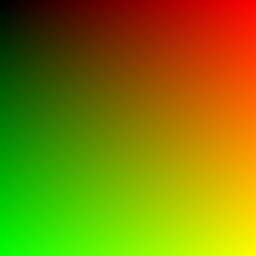
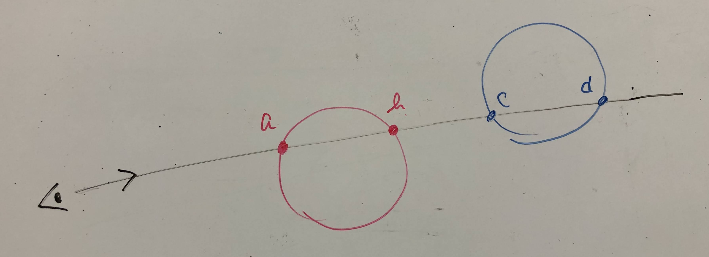
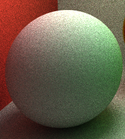
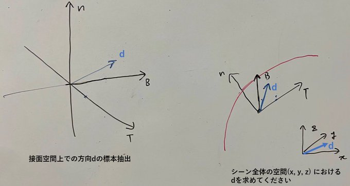
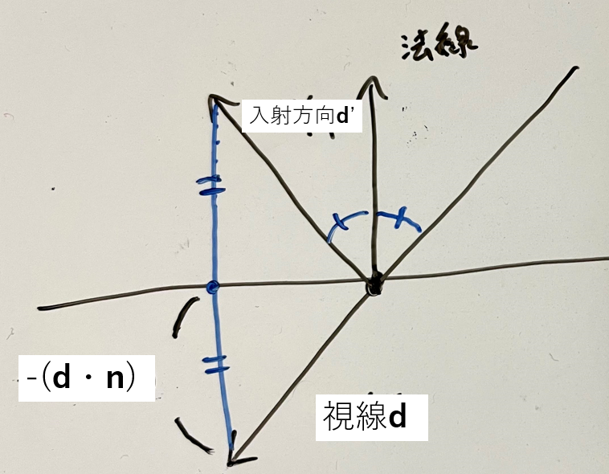

# Ray Tracing on Processing

この回の目的はレイトレーシングによるレンダリングを行うときの要点を知ることと、それを利用したパストレーシングというレンダリング法の考え方を知ることです。 そのために穴埋め形式の問題を解きながら各手法を実装します。
以下で目次の直後にレイトレーシングとパストレーシングの説明がそれぞれ書いてあります。
テキスト本編ではあまり深入りしない説明をしてるので、細かい仕様について疑問がある人はslack上で質問してください。 また、[末尾](#参考)に記載した参考資料も読んでみてください。


[TOC]


## レイトレーシングの説明

レイトレーシングの説明をします。
三次元の物体を二次元のスクリーン(画面)に描画することを3DCGにおけるレンダリングといいます。
そのための最も初歩的な課題として、
遠近感など**視界から見える形状を再現する**という問題と、
複数の物体が重なって見える場合に**形状の前後関係を正しく表示する**という問題がありました。

これらを解決する方法の一つとして、レイトレーシングが提案されました。

レイトレーシングはスクリーン上の画素に、視点から直進する光線(レイ)を飛ばし、追跡することによってその先に何が見えるのかを計算し、色を決定します。


<a id="パストレーシングの説明"></a>
## パストレーシングの説明

レイトレーシングを繰り返し用いて照明を計算する手法であるパストレーシングの説明をします。
3Dシーン中で、現実のように光源からの光が散乱を繰り返し目に光が届くことを仮定すると、下図のように目と光源を結ぶ経路を作ることができます。
このような任意の経路について、光源から放出された光がこれに沿って運ばれるうちに減衰し、視点に到達する光を計算することができます。
パストレーシングは、可能なすべての経路によって運ばれる光をシミュレーションし合計することで視点に映る像を得るという計算方法です。


<a id="サンプルプログラムの解説"></a>
## サンプルプログラムの解説

この教材の説明はすべて `prt/prt.pde` のファイル上に書かれたものに対して行います。
また、テキストに従ってプログラムを書き換え/書き加えたり課題を解くときにも、すべて同ファイルの編集をするものとします。
他のファイルにはクラスや関数が定義してあります。
授業に必要な情報はすべてこのテキストに記しているため必須ではありませんが、これらの内容を読むことはより深い理解に繋がります。

視点からの光線と物体の交点を計算するレイトレーシングによるレンダリングでは、各画素に対してどのような色を表示するかを計算し、結果画像を得ます。
サンプルファイルをダウンロードしてください。 それを実行すると、次のような画像が表示されます。



これからサンプルの内容を確認します。

### `void setup()`

```java
void setup() {
  colorMode(RGB, 1.0);
  size(512,512);
}
```
今回は光の強さを直接計算しやすいよう、`colorMode(RGB, 1.0)`でRGBそれぞれの値を[0,1]で設定できるようにします。

### `void draw()`

```java
void draw() {
  // pixels を更新
  loadPixels();
  for (int y=0; y<height; y++) {
    for (int x=0; x<width; x++) {
      pixels[y*width + x] = render(x, y);
    }
  }
  updatePixels();
}
```
ここでは結果画像の値を直接与えます。 for文を使ってすべての位置 (x, y) の画素にアクセスし、 `render(x, y)` という関数で値を決めています ([復習 - 画素の操作による画像処理](http://www.design.kyushu-u.ac.jp/~morimoto/teaching/materials/ballGame8.html#1-%E7%94%BB%E7%B4%A0%E3%81%AE%E6%93%8D%E4%BD%9C%E3%81%AB%E3%82%88%E3%82%8B%E7%94%BB%E5%83%8F%E5%87%A6%E7%90%86))。
画面空間の軸は、画像左上の頂点を原点として右向きに +x 軸、下向きに +y 軸をとります。
次に関数 `render(x, y)` の中身をみます。


### `color render(int x, int y)`

```java
color render(int x, int y) {
  PVector result = new PVector((float)x/width, (float)y/height, 0);
  return toColor(result);
}
```
この関数は、座標 (x, y) の色を作って返す関数です。
あとでの計算のしやすさのために、内部では色を `PVector` で表現することとします。
`PVector` の要素である x 成分が 色の R 成分、 y 成分が 色の G 成分、 z 成分が 色の B 成分と考え、最後に `toColor` 関数で正規化された `color` 型として返します。
サンプルではRの値が x/width, Gの値が y/height, そしてBは 0 です。 つまり画像の右へいくほど赤、下へ行くほど緑であるプログラムになっています。
このサンプルを書き換えていき、レイトレーシングやパストレーシングを実装していきます。


<a id="一つの球体を表示する"></a>
## 一つの球体を表示する

まずは一つの物体を表示します。
以下の指示に従ってprt.pde のプログラムを書き換えてください。


<a id="レイトレーシング機能の追加"></a>
### レイトレーシング機能の追加

#### シーンの設定

まず、`void setup()` や `void draw()` などのブロックより外側に次のコードをコピペし、カメラ、背景色、球体のデータを用意します。
```java
Camera camera;
Material environment;
Sphere sphere;
```
このように、ブロックのもっとも外側にに宣言した変数はグローバル変数(または大域変数)と呼ばれ、processing のすべての場所から使うことができます ( [スコープ](http://www.design.kyushu-u.ac.jp/~morimoto/teaching/materials/drawing0.html#2-%E3%82%B9%E3%82%B3%E3%83%BC%E3%83%97) )。
以降、ここにシーンの設定を保持し処理のために使います。

次に `createScene` という関数を作り、その中でシーンのパラメータを設定します。
```java
void createScene() {
  // (0,-10,2)から(0,0,0)を見るカメラを設定. 焦点距離は55mm.
  camera = new Camera(new PVector(0,-10,2), new PVector(0,0,0), 55);

  // 背景色(発光)を設定する
  environment = new Material(new PVector(0.6, 0.7, 0.8), null);

  // 材質を用意する
  Material white  = new Material(null, new PVector(0.6, 0.6, 0.6), MtlType.DIFFUSE);
  Material red    = new Material(null, new PVector(0.8, 0.2, 0.2), MtlType.DIFFUSE);
  Material green  = new Material(null, new PVector(0.2, 0.8, 0.2), MtlType.DIFFUSE);

  // (0,0,0) に半径2の赤い球を配置
  sphere = new Sphere(new PVector(0, 0, 0), 2, red);
}
```
使われているクラスを構築するパラメータを以下の表にまとめました。
`createScene` の中を見て、それぞれのクラスにどのような情報が持たせられているか確認しましょう。
シーンを置く世界の軸は、 +x 軸と +y 軸 の外積が +z 軸となるようにとります。
また、この座標系を +z 軸を上として扱うことにします。
提供したコードでカメラは -y 方向を見ています。

| クラス | コンストラクタの引数 |
|:-:|:-|
| `Camera` | カメラ位置, どこを見るか, 35mm換算の焦点距離 |
| `Material` | 発光色, 反射色, 拡散 or 鏡面反射(省略可) |
| `Sphere` | 中心の位置, 半径, マテリアル |

`createScene()` を `void setup()` 内で呼びます。
```java
void setup() {
  colorMode(RGB, 1.0);
  size(512,512);

  createScene();

```


#### `color render(int x, int y)` を書き換える

```java
color render(int x, int y) {
  Ray view = camera.ray(x, y, random(1), random(1)); // ★
  Hit hit = sphere.intersect(view, 0.0001, 10000); // ◆

  // レイと物体の交点があれば、物体の色を返す
  // なければ背景の色を返す
  if(hit != null) return toColor(hit.material.Color()); // ▼
  else return toColor(environment.emission);
}
```
`render` 関数の中で各画素方向への**★視線の生成**, 球体との**◆交差判定**, 判定結果による**▼描画色の決定**を行っています。
現時点でプログラムで実行すると、シーンで配置したように中央に赤い球体が出ます。


<a id="レイトレーシングの基本"></a>
### レイトレーシングの基本

レイトレーシングでおこなう**視線の生成**と**交差判定**, 判定結果による**描画色の決定**それぞれの処理について説明します。

#### ★視線の生成

カメラの姿勢と画像上の位置が決まることで、どこからどの方向を視線が向いているかが決定します。
今回のプログラムでは、 `Camera.ray` という関数を使って視線を求めます。
視点と視線の方向は、次に示す `Ray` クラスとして保持されます。
```java
class Ray {
  PVector o; // レイの原点(視点)
  PVector d; // レイの方向
}
```


#### ◆交差判定

視線が決まったら、それが物体と交差するかを判定し交点の情報を求めます。
このために `Hit Sphere.intersect(ray, tmin, tmax)` という関数を使います。
これは球と視線が距離の区間 ( tmin, tmax ) の範囲で交差するかを判定します。
返り値として、交点があればその点の情報 `Hit` を返し、無ければ `null `を返します。
カメラの前にある物体を判定したいので、区間にはとりあえず十分に広い正の範囲を設定します。


返り値であるHitクラスの内容はつぎのようになっており、色や照明の計算に利用されます。
```java
class Hit {
  float distance;     // 視点から交点までの距離
  PVector position;   // 交点の位置
  PVector normal;     // 交点の法線
  Material material;  // 交点の材質
}
```
Processing における `null` とは、変数の実体がメモリに確保されていないことを示します。
視線が物体と交差しないときには交点がありませんので、 `Sphere.intersect` の返り値は `null` です。

#### ▼描画色の決定

得られた `Sphere.intersect` の結果を使って画素の色を決めます。
ここでは視線と物体の交点があれば物体色 `hit.material.Color()` を返し、無ければ背景色 `environment.emission` を返します。
前述の通り、交点がないとき `hit == null` なので、 if 文を使って分岐します。
```java
if(hit != null) return toColor(hit.material.Color());
else return toColor(environment.emission);
```

<a id="Ex.A"></a>
## Ex.A

1. 球体やカメラのパラメータを変更した画像を作ってください。
1. 物体色を法線の値を使って決めてください。法線は `Hit.normal:PVector` として保持されているので、 `render` 内にある `toColor` に渡すことで processing の色として値を返すことができます。


<a id="たくさんの物体を表示する"></a>
## たくさんの物体を表示する

レイとシーン中の物体が複数の交点を持つとき、前後関係を正しく描画するためには目から一番近い交点を採用する必要があります。
図のような状況では、

この処理をおこなう関数 `Hit findNearestIntersection(Ray ray, float tmin, float tmax)`を追加し、 `render` のほうで利用するようにします。
以降の指示に従ってプログラムを書き換えてください。




<a id="レイトレース関数の書き換え"></a>
### レイトレース関数の書き換え

#### シーンの変更

複数のオブジェクトを配置します。 まずグローバル変数で宣言した球体を配列に変更します。
```java
Sphere sphere;
    ↓ 書き換え
Sphere[] spheres;
```
次にcreateSceneを以下で置き換えてください（カメラの設定も変わっているので注意）。
```java
void createScene() {
  // (0,-10,2)から(0,0,2)を見るカメラを設定. 焦点距離は55mm.
  camera = new Camera(new PVector(0,-10,2), new PVector(0,0,2), 55);

  // 背景色(発光)を設定する
  environment = new Material(new PVector(0.6, 0.7, 0.8), null);

  // 材質を用意する
  Material white  = new Material(null, new PVector(0.6, 0.6, 0.6), MtlType.DIFFUSE);
  Material red    = new Material(null, new PVector(0.8, 0.2, 0.2), MtlType.DIFFUSE);
  Material green  = new Material(null, new PVector(0.2, 0.8, 0.2), MtlType.DIFFUSE);
  Material mirror = new Material(null, new PVector(0.9, 0.6, 0.1), MtlType.SPECULAR);
  Material light  = new Material(new PVector(10,10,10), null);

  // 球を配置する
  spheres = new Sphere[] {
    new Sphere(new PVector(-2 ,-1.5, 0), 2,  white), // ball left
    new Sphere(new PVector( 2 , 1.5, 1), 2, mirror), // ball right
    new Sphere(new PVector( 0,-2,10), 3,  light),    // light
    new Sphere(new PVector( 105, 0, 0), 100, green), // wall left
    new Sphere(new PVector(-105, 0, 0), 100,   red), // wall right
    new Sphere(new PVector( 0, 0,-102), 100, white), // floor
    new Sphere(new PVector( 0, 110, 0), 100, white), // wall back
  };
}
```

#### `color render(int x, int y)` の変更

`render` 内の処理を `findNearestIntersection` を使うように書き換えます。
```java
Hit hit = sphere.intersect(view, 0.0001, 10000);
    ↓ 書き換え
Hit hit = findNearestIntersection(view, 0.0001, 10000);
```

#### `findNearestIntersection`の追加

最後に、findNearestIntersectionを作ります。
```java
Hit findNearestIntersection(Ray ray, float tmin, float tmax) {
  Hit hit = null;

  // ここに一番近い交点を探し、hit に代入する処理を書く
  ////////////////////////////////////////////


  ////////////////////////////////////////////

  // 最後に、球が裏面の場合は法線を反転する
  if (hit != null && PVector.dot(ray.d, hit.normal)>0) {
    hit.normal.mult(-1);
  }

  return hit;
}
```
いまこの中身は不完全です。
次の課題としてこの処理を完成させてください。


<a id="Ex.B"></a>
## Ex.B

配列すべての球との交差判定をおこない、一番近い交点情報を返す関数を完成させてください。
視点と交点との距離は `Hit.distance` に格納されています。
関数が完成し、 `render` 内で物体色や法線を描画をすると次のような画像が得られます。
自分で適当に `render` を変更して、前後関係が正しく動作することを確認してください。
どちらか片方の画像を表示するプログラムが提出されれば合格となります。

| `hit.material.Color()` で描画 | `hit.normal` で描画 |
|:-:|:-:|
|  |  |


<a id="パストレーシングで陰影をつける"></a>
## パストレーシングで陰影をつける

前章までで配置した物体に設定した色を描画することができました。
最後にパストレーシングによる陰影計算をおこないます。
追加する処理は**経路の生成**、**光の輸送**、 **視点に届く光の累積**です。

<a id="経路の生成と光の輸送"></a>
### 経路の生成と光の輸送

パストレーシングでは光線が物体に当たったとき、その反射方向へ向かってさらに光線の追跡を続けます。
また反射の際には物体に光が吸収されるため、その減衰を計算する必要があります。
この節では、一回の反射について反射方向の決定と光の減衰を計算する関数 `PVector trace(Ray ray, int n)` をつくります。
また、これを繰り返し呼び出すことで何度も散乱された光の経路を追跡します。

`trace` の処理についてさらに説明します。
照明のあたった物体の色は入射光と物体色の積です。
物体色のほうは `material` に保持されていますが、入射光は未知です。
入射光を得るためには、再び一つの方向へ向かってレイトレーシングをおこない、その先にどの物体や光源があるかを調べます。
もし追跡結果の交点が光源であれば、その強さが入射光です。
交点が反射面である場合には、さらに追跡を続けます。


以下の `trace` 関数を自分のプログラムにコピーしてください。
最後の課題は、コメントに従ってこの関数を完成させることです。
この問題では反射を繰り返し追跡するために再起的に `trace` を呼び出すことを想定した雛形を提供しています。
その際あまりに反射を繰り返し続けることを防ぐため反射回数nを0からカウントアップし、適当な回数で処理を打ち切ります。
これを `render` のほうで利用します。
```java
PVector trace(Ray ray, int n) {

  // 反射回数が多いとき追跡をやめる(黒を返す)
  if (10<n) return new PVector(0, 0, 0);

  Hit hit = findNearestIntersection(ray, 0.0001, 100000); // 光線と物体の交点を探す
  PVector result = new PVector(0,0,0); // 結果用の変数

  // 交点がないとき背景からの放射を返す
  if (hit == null) return environment.emission;

  // 光源にあたったとき(emission があるとき) その値を結果に足す
  if (hit.material.emission != null) result.add(hit.material.emission);


  // 反射面に当たったとき(reflection があるとき)、さらに入射方向を追跡し、反射光を結果に足す
  if (hit.material.reflection != null) {

    // 接面の基(T, B, hit.normal)を用意する
    PVector T = new PVector();
    PVector B = new PVector();
    tangentspace_basis(hit.normal, T, B);

    // 反射の種類によって追跡する方向を決め、ray を更新する
    switch (hit.material.type) {
    case DIFFUSE:
      // 拡散反射する光線の原点と方向を更新する

      PVector dir = sampleHemisphere_cosine(random(1), random(1));
      ray.o =
      ray.d =
      break;

    case SPECULAR:
      // 鏡面反射する光線の原点と方向を更新する

      ray.o =
      ray.d =
      break;
    }

    // 1. この実装では、入射としてこのtrace関数を再帰的に利用することを想定しています。
    //
    // 2. 色の積を計算するために、 multC(PVector, PVector)->PVector 関数を
    // 利用することができます。これは二つのベクトルの次元ごとの積を新たなベクトルとして返します。
    //
    result.add( /*　ray方向から入ってくる入射光と物体色の積を結果に足す　*/ );
  }

  return result;
}
```

<a id="光の累積"></a>
### 光の累積

`trace` は、光が反射するたびにあらゆる方向から入射してくる光のうち一方向だけランダムに選んで追跡します。
これを繰り返すと枝分かれのない一本の経路が作られ、それに沿って運ばれる光を計算することができます。
経路を何本も追跡することで、その総和は次第にシーン全体から画素に運ばれてくる光に近づきます。


パストレーシングの計算方法では、ランダムに抽出された経路が運ぶ光の期待値が画素値となるように設計されています。
何本もの経路を追跡するときには、それぞれから得た期待値（画素値）を平均することで、より精度の高い画像となります。
今回書くプログラムでは、実行時1フレームごと新たに経路を追跡し、前フレームまでに得られた光との総和を計算するようにします。
以下の指示に従って自分のプログラムを書き換えてください。

#### グローバル変数に以下を追加する

```java
int count = 0; // 追跡した経路の数
PVector[] accumlated_radiance; // 画素ごとの寄与の合計を入れておく配列
```
配列は `setup` の中で `accumlated_radiance` を初期化します。
```java
accumlated_radiance = new PVector[width*height];
for (int i=0; i<width*height; i++) {
  accumlated_radiance[i] = new PVector(0, 0, 0);
}
```

#### `void draw()` の中でサンプル数をカウントする

```java
void draw() {
  count++; // 追跡した経路の数をかぞえる

  loadPixels();
  for (int y=0; y<height; y++) {

  //...
```

#### `color render(int x, int y)` 内で各フレームの `trace` 結果の平均を求める

```java
color render(int x, int y) {
  Ray view = camera.ray(x, y, random(1), random(1));
  accumlated_radiance[y*width+x].add( trace(view,0) ); // 合計に新しいサンプルを足す
  PVector average = PVector.div( accumlated_radiance[y*width+x], count );
  return toColor(average);
}
```
`trace` の第二引数は反射回数です。 最初は0から始め、 `trace` するたびに1ずつ大きくします。


<a id="Ex.C&D"></a>
## Ex.C&D

`PVector trace(Ray ray, int n)` の空欄を埋め、反射方向を繰り返し追跡することにより陰影を計算してください。
**反射の種類によって追跡する方向を決め、ray を更新する**部分のより詳しい説明を以下に書きます。
この問題は、 `case DIFFUSE:` と `case SPECULAR:` のそれぞれが解けたら1点を与えます。
片方を解かずに提出する場合には、 `ray.o =` を消す等して、エラーを出さず実行できる形で提出してください。


<a id="Ex.C"></a>
### Ex.C

`trace` 関数の `case DIFFUSE:` 内を埋め、 `ray.o` と `ray.d` を更新してください。




材質が光を拡散反射する場合です。
`sampleHemisphere_cosine(random(1), random(1))` は接面空間 $(\boldsymbol{T}\boldsymbol{B}\boldsymbol{n})$ 上での拡散反射の方向を求めます。
ここで接面空間とは、hitした面上の点における法線 $\boldsymbol{n}$ と、それに垂直な面上から適当に選んだ正規直交な基 $\boldsymbol{T}, \boldsymbol{B}$ からなる空間です。
ここでは反射の方向のみに興味があり、それは空間の原点に関係ないので、接面空間は3次元空間の線形変換です。
詳しくは [シェーディングのための正規直交基底](https://rayspace.xyz/CG/contents/orthonormal_basis/) の接平面ベクトルの参照してください。

この空間上で選ばれた方向 `dir` を、シーン全体を定義した空間（x, y, z 座標系）上での方向になおし、光線の追跡を続けてください。
プログラム上で接面空間の基は `T:PVector, B:PVector, Hit.normal` として用意されています。

#### PVector のみを用いる場合
接面空間上で選んだ方向を $\boldsymbol{d} = (d_0; d_1; d_2)$ とすると、シーンの空間における方向は $\boldsymbol{d'} = d_0 \boldsymbol{T} + d_1 \boldsymbol{B} + d_2 \boldsymbol{n} $ です。

#### PMatrix とPVector を用いる場合
[PMatrix](https://processing.github.io/processing-javadocs/core/processing/core/PMatrix.html)を使う場合です。
もとの空間から接面空間への変換が $(\boldsymbol{TBn})$ なので、この逆変換を選んだ方向 $\boldsymbol{d}$ にかけることで求める方向 $\boldsymbol{d'}$ が得られます。　式は $d' = (TBn)^{-1} d$ です。


<a id="Ex.D"></a>
### Ex.D

`trace` 関数の `case SPECULAR:` 内を埋め、 `ray.o` と `ray.d` を更新してください。




材質が光線を完全鏡面反射する場合です。
探索を続ける方向すなわち鏡面反射の入射方向を求めてください。
現在の探索方向(視線) $\boldsymbol{d}$ 、次に探索する方向(入射方向) $\boldsymbol{d'}$ 、法線 $\boldsymbol{n}$ は図より $\boldsymbol{d'} = \boldsymbol{d} - 2(\boldsymbol{d}\cdot\boldsymbol{n})\boldsymbol{n}$ という関係を持ちます ([反射ベクトルを求める](https://qiita.com/edo_m18/items/b145f2f5d2d05f0f29c9))。
`a:PVector` と `b:PVector` の内積 $(\boldsymbol{a}\cdot\boldsymbol{b})$ は `PVector.dot(a,b):float` で計算できます。


<a id="参考"></a>
## 参考

1. [はじめようレイトレーシング](https://www.raytracing.xyz/)
この授業はこのページを参考にしています。
授業時間のために省いた部分の説明などを読むことができます。 リンク先の最終的なプログラムを見ると今回の課題を解くことができると思います。
1. [Eric Veach. 1998. Robust monte carlo methods for light transport simulation.](https://www.amazon.co.jp/dp/4621061240/ref=cm_sw_em_r_mt_dp_rrG0FbMTEQAD9)
パストレーシングの丁寧な解説を読むことができます。
1. [memoRANDOM](https://rayspace.xyz/CG/)
パストレーシングとレンダリング方程式の項目が今回の内容と関連が深いです。
1. [パターン認識と機械学習 下](https://www.amazon.co.jp/dp/4621061240/ref=cm_sw_em_r_mt_dp_rrG0FbMTEQAD9)
11章"サンプリング法"に今回使ったモンテカルロ法の説明があります。
